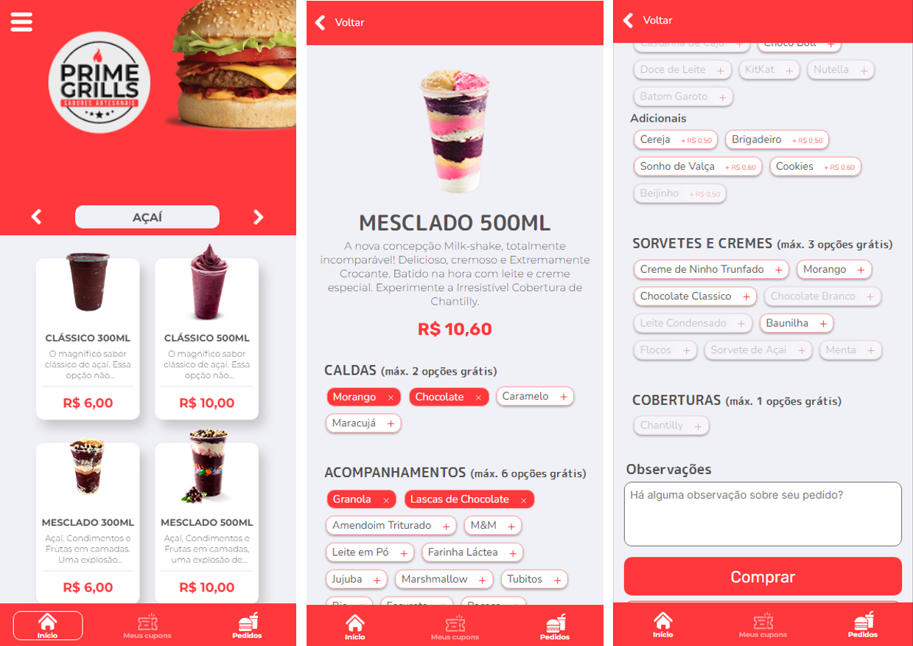
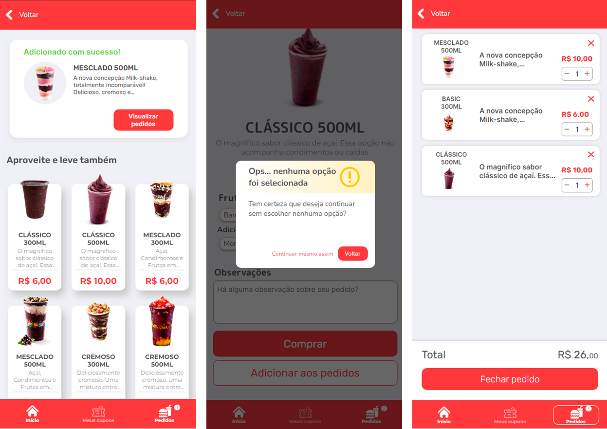
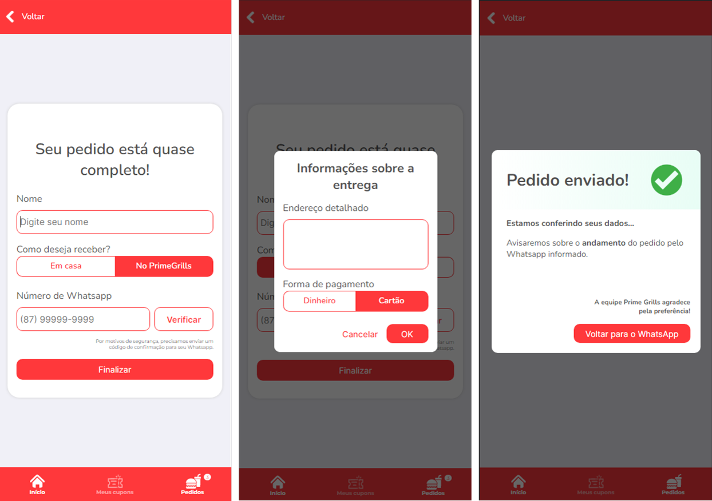

<p align="center">
  
</p>

<h1 align="center">
Aplicação para Food Delivery</br>
(Frontend)
</h1>
<p align="center">

  

  

  <a href="https://www.linkedin.com/in/wendelspereiraneto/">
      
  </a>

  <a href="https://github.com/wendelspereira/primegrills/commits/master">
      
  </a>

  
</p>

<p align="center">
  <a target="_blank" href="https://reactjs.org/">
    
  </a>
  <a target="_blank" href="https://nextjs.org/">
      
  </a>
</p>

<h1 align="center">
  Seja bem-vindo ao Primegrills
</h1>

## Sobre o Projeto

<p>
Primegrills consiste em uma lanchonete que atende seus clientes presencialmente e na modalidade delivery. Buscando oferecer um melhor atendimento ao seus clientes, decidiu-se desenvolver uma aplicação que possibilitasse os clientes selecionar e configurar seus pedidos de forma simples, amigável e intuitiva.
</br>
</br>
Esta aplicação foi idealizada para uso atraves de um terminal de autoatendimento no ambiente da lanchonete e também para uso em dispositivos móveis pela internet possibilitando os clientes fazerem seus pedidos e receberem em casa.
</br>
</br>
Durante o desenvolvimento da aplicação, a lanchonete foi feichada devido o agravamento da pamdemia e o projeto foi pausado.
</p>

## Link paro o projeto

[primegrills.com.br](https://primegrills.com.br/)


## Melhorias a serem feitas
    -Adicionar api serverless na aplicação;
    -Localização do cliente por mapa
    -Andamento do pedido
    -Cadastro do cliente para acesso a cupons e ofertas
    -Adicionar compartilhar com Redes Sociais
    -Adicionar Firebase para efetuar autenticação;
    -Adicionar mongodb para salvar informações;
    -Implementar testes


## Layout
Todo o layout é de autoria propria.

<!-- ### Mobile
<h4 align="center">
  
  
  
  <!--  -->
<!-- </h4> -->

### Web

<h4 align="center">
  
</h4>
<h4 align="center">
  
</h4>
<h4 align="center">
  
</h4>

## Tecnologias

- **[TypeScript](https://www.typescriptlang.org/)**
- **[NextJS](https://nextjs.org/)**
- **[Eslint](https://eslint.org/)**
- **[Prettier](https://prettier.io/)**
- **[MongoDB](https://www.mongodb.com/)**

## Comandos

- `dev`: Executa a aplicação em `localhost:3000`
- `build`: Cria a Build do projeto
- `start`: Inicia um servidor simples com o código de produção

## Como executar este projeto

Para clonar e executar este aplicativo, você precisará ter o [Git](https://git-scm.com) e [NodeJs](https://nodejs.org/en/) instalado em seu computador.

### Clonando o repositório

```bash
# Clone este repositório
$ git clone https://github.com/wendelspereira/primegrills

# Acesse a pasta do projeto no terminal/cmd
$ cd primegrills
```

### Rodando a Aplicação

```bash
# Instale as dependências
$ npm install
$ yarn install

# Execute a Aplicação em Desenvolvimento
$ npm run dev
$ yarn dev

# Acesse http://localhost:3000
```

<!-- ### 📁 Configuração .ENV

```bash
#adicionado .env.example no projeto, lembrar de adicionar as variáveis de ambiente conforme o exemplo

# MONGODB

# API URLS

```
-->

## Como contribuir para o projeto

- Faça um **fork** do projeto;
- Crie uma nova branch com as suas alterações: `git checkout -b my-feature`
- Salve as alterações e crie uma mensagem de commit as descrevendo: `git commit -m "feature: My new feature"`
- Envie as suas alterações: `git push origin my-feature`

> Caso tenha alguma dúvida confira este [guia de como contribuir no GitHub](https://github.com/firstcontributions/first-contributions)

## Licença

Este projeto esta sob a licença MIT. Veja a [LICENÇA](https://opensource.org/licenses/MIT) para saber mais.

Desenvolvido por Wendel S. Pereira [Entre em contato!](https://www.linkedin.com/in/wendelspereira/)
